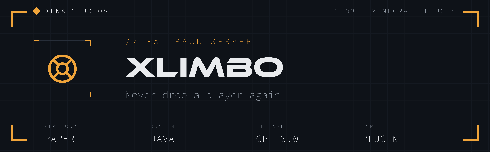

A rock-solid **fallback / limbo** server plugin for **Paper** (Pufferfish) networks. When your
main server crashes, restarts or becomes unreachable, players routed to xLimbo land in an empty
void world — creative mode, flight enabled, on an unbreakable glass floor — so they stay connected
to the network instead of being disconnected. When the main server is back, they hop straight over
with `/join` (or automatically).

xLimbo is built to **never go down**: every code path fails safe. It never throws out of
enable/reload, never blocks the main thread, never disables itself on a bad config value, and no
single player action can lag, crash, grief or escape the sandbox.

---

## Features

- **Void world** owned by the plugin — created programmatically with an ultra-cheap generator
  (one shared glass-floor layer per chunk; caves, decorations, structures, mobs and noise all
  disabled). Ephemeral: autosave off, spawn chunks not kept loaded, optional safe reset on restart.
- **Join flow** — players are put in creative + flight and **async-teleported** to a bounded,
  spread-out random spawn (chunk preloaded first, so the join tick never blocks on generation).
- **World border** bounds all roaming and caps total chunk generation; random spawns always land
  inside it.
- **`/join`** — sends the player to the main server via the proxy (BungeeCord `Connect` message),
  with configurable aliases, permission and a per-player cooldown to stop proxy spam.
- **Optional auto-join** — send players back automatically after a delay.
- **Optional action bar** — repeating hint (component parsed once, reused each cycle).
- **Message control** — suppress join/quit/death broadcasts; optional custom join message and
  chat clear. All text is MiniMessage and fully configurable.
- **`/xlimbo reload` / `/xlimbo info`** — reload re-reads and re-validates config and re-applies live.
  A few settings are restart-only: `join-command.aliases`, `world.name`, `world.floor-y` and
  `world.floor-block` (the world/generator is fixed at creation).
- **Exploit resistance** (all individually toggleable, safe defaults on): unbreakable floor, void
  rescue, blocked portals, no liquids, no gravity blocks, no fire, no explosions, no mob spawns,
  no redstone, no item drops, entity-item blocking + periodic cleanup, and an optional build-rate
  guard against lag machines.

---

## Requirements

- **Paper (or a fork like Pufferfish) 1.18.2 or newer.** xLimbo compiles against the Paper 1.18.2
  API — the oldest release that provides everything it needs without shading extra libraries
  (modern `ChunkGenerator` hooks + `BiomeProvider` from 1.17, and bundled MiniMessage/Adventure
  4.11 from 1.18.2). A plugin compiled against 1.18.2 runs on all newer versions.
- **Java 21 runtime.** The jar is compiled to Java 21 bytecode, so the server must run on Java 21+
  (standard on modern networks).

---

## Install

1. Grab a jar (see **Downloads** below) and drop it in your xLimbo server's `plugins/` folder.
2. Start the server once — xLimbo creates the `xlimbo` world and writes a default `config.yml`.
3. Edit `plugins/xLimbo/config.yml` to taste, then run `/xlimbo reload` (most settings apply live;
   aliases, `world.name`, `floor-y` and `floor-block` need a restart).
4. Point your proxy's fallback/xlimbo server at this instance and set `main-server` in the config to
   the proxy name of the server you want `/join` to send players to.

### Downloads

- **Stable releases:** https://github.com/xena-studios/xlimbo/releases/latest — semantic-version
  releases (`vMAJOR.MINOR.PATCH`) cut from git tags. Also published to
  [Modrinth](https://modrinth.com/) on each release.
- **Nightly builds:** the rolling [`nightly`](https://github.com/xena-studios/xlimbo/releases/tag/nightly)
  pre-release always carries `xLimbo-nightly.jar`, the freshest build of `main`. Pre-release —
  handy for testing, not for production.
- **Per-commit builds:** every push and PR uploads the jar as a workflow artifact under the
  repository's **Actions** tab.

Versioning is semantic and derived from git tags. A tagged commit builds to a clean version
(e.g. `1.2.0`); any commit after the latest tag builds to a nightly pre-release identity
(`<version>-nightly.<n>+<short-sha>`). The exact identity lives in `plugin.yml`,
`build-info.properties` and `/xlimbo info`.

---

## Configuration reference

Full, commented defaults live in [`src/main/resources/config.yml`](src/main/resources/config.yml).
`config-version` is managed by the plugin — on upgrade, new keys are merged in without wiping your
settings. Invalid values fall back to their default with a console warning; the plugin never
disables itself over config.

| Key | Default | Description |
| --- | --- | --- |
| `world.name` | `xlimbo` | xLimbo world name (created if missing). |
| `world.floor-block` | `GLASS` | Block making up the shared floor layer. |
| `world.floor-y` | `64` | Y of the floor; players spawn one block above. |
| `world.auto-save` | `false` | Keep the world ephemeral (recommended). |
| `world.reset-on-startup` | `false` | Safely delete + recreate the world each start. |
| `world.border.size` | `10000` | World-border width in blocks (radius = size/2). |
| `world.border.spawn-radius` | `4000` | Random spawns land within ±this of center (auto-clamped inside the border). |
| `world.view-distance` | `4` | Per-world view distance (`-1` = server default). |
| `world.simulation-distance` | `4` | Per-world simulation distance (`-1` = server default). |
| `player.set-creative` | `true` | Put joining players in creative. |
| `player.enable-flight` | `true` | Enable + enforce flight on join. |
| `join.suppress-join-message` | `true` | Hide vanilla join broadcast. |
| `join.custom-join-message` | *(set)* | MiniMessage shown to the joining player (empty = none). |
| `join.clear-chat-on-join` | `false` | Clear the player's chat on join. |
| `quit.suppress-quit-message` | `true` | Hide vanilla quit broadcast. |
| `death.suppress-death-message` | `true` | Hide vanilla death broadcast. |
| `main-server` | `main` | Proxy server name `/join` sends players to. |
| `auto-join.enabled` | `false` | Auto-connect players back after a delay. |
| `auto-join.delay-seconds` | `30` | Delay before auto-connect. |
| `auto-join.message` | *(set)* | Message on auto-connect (empty = none). |
| `join-command.enabled` | `true` | Enable `/join`. |
| `join-command.aliases` | `[server, lobby]` | Extra aliases (base `join` always exists). |
| `join-command.permission` | `xlimbo.join` | Permission to use `/join`. |
| `join-command.cooldown-seconds` | `3` | Per-player cooldown. |
| `join-command.message-sending` | *(set)* | Feedback; supports `<server>`. |
| `join-command.message-cooldown` | *(set)* | Cooldown feedback; supports `<seconds>`. |
| `action-bar.enabled` | `true` | Repeating action-bar hint. |
| `action-bar.interval-ticks` | `40` | Ticks between updates (min 1). |
| `action-bar.message` | *(set)* | Action-bar MiniMessage. |
| `protections.floor` | `true` | Floor unbreakable/unmodifiable. |
| `protections.void.enabled` | `true` | Rescue players who fall below the threshold. |
| `protections.void.threshold-y` | `0` | Y that triggers the rescue teleport. |
| `protections.void.cancel-void-damage` | `true` | Cancel void/fall damage. |
| `protections.portals` | `true` | Block nether/end portal creation + Eye of Ender. |
| `protections.liquids` | `true` | Block bucket placement + liquid flow. |
| `protections.gravity-blocks` | `true` | Block sand/gravel/anvil/etc. + falling entities. |
| `protections.fire` | `true` | Cancel ignition/spread/burn. |
| `protections.explosions` | `true` | Cancel block + entity explosions. |
| `protections.mob-spawns` | `true` | Cancel natural mob spawns. |
| `protections.redstone` | `true` | Disable redstone activity. |
| `protections.item-drops` | `true` | Cancel player item drops. |
| `protections.entities.block-entity-items` | `true` | Block armor stands, boats, minecarts, frames, paintings, end crystals, spawn eggs. |
| `protections.entities.cleanup-interval-seconds` | `300` | Periodic stray-entity sweep (0 = off). |
| `protections.build-guard.enabled` | `false` | Cap per-player block placements/second. |
| `protections.build-guard.max-places-per-second` | `30` | The cap (0 = unlimited). |

### Commands & permissions

| Command | Permission | Default | Description |
| --- | --- | --- | --- |
| `/join` (+ aliases) | `xlimbo.join` | everyone | Connect to the main server. |
| `/xlimbo reload` | `xlimbo.admin` | op | Reload + re-apply config live. |
| `/xlimbo info` | `xlimbo.admin` | op | Show build/version + runtime status. |

---

## Recommended server-level tuning

Some performance and security tuning lives **outside** the plugin. For a fallback server that
should stay flat under load:

- **`server.properties`**
  - `view-distance=4`, `simulation-distance=4` (xLimbo also sets these per-world, but the global
    default matters for any other world and for the initial spawn world).
  - `spawn-protection=0`, `allow-nether=false`.
  - **`online-mode=false` only behind a proxy** — and only with secure forwarding (below).
- **`spigot.yml`** — lower `entity-tracking-range` values and `merge-radius`; keep
  `view-distance` in step.
- **`pufferfish.yml` / Paper's `config/paper-world-defaults.yml`** — tighten entity activation
  ranges, disable ticking far from players, and keep `max-auto-save-chunks-per-tick` low
  (xLimbo runs with autosave off anyway).
- **Proxy forwarding security (important):** the `/join` "Connect" plugin message can be spoofed
  by clients if forwarding isn't secured. Configure **Velocity modern forwarding** (or a
  BungeeCord IP-forwarding guard / firewall so only the proxy can reach the backend) so players
  can't impersonate the proxy or move themselves around the network. The plugin cannot enforce
  this — it must be set up on the proxy + server.

---

## How it stays fast & stable

- **Immutable settings snapshot.** Config is parsed once into an immutable object (with MiniMessage
  components pre-parsed) and swapped atomically on `/xlimbo reload`. No hot path — per-tick,
  per-chunk or per-event — ever reads `getConfig()` or re-parses MiniMessage.
- **O(1) generation.** The generator writes one floor layer and disables every vanilla phase via
  the `shouldGenerate*` hooks, with a single fixed biome. Chunk cost is flat no matter how far
  players roam, and the world border caps how far that can go.
- **Async where it matters.** Join teleports use `teleportAsync` after `getChunkAtAsync` preloads
  the destination, so the join tick never blocks on generation. World creation happens once at
  startup, never during ticks; the optional world reset uses an absolute path, never throws and
  never runs while players are on.
- **Ephemeral world.** Autosave off, spawn chunks not kept in memory, reduced view/simulation
  distance — the world doesn't bloat disk or RAM.
- **Register only what's enabled.** Listeners and tasks are only registered for enabled features,
  and torn down/rebuilt cleanly on reload — no leaked tasks, no dead handlers.
- **Fail-safe everywhere.** `onEnable`/`reload` are wrapped so they can never throw out; a failing
  feature is logged and skipped rather than taking the server (and everyone on the network) down.

---

## Building

```bash
./gradlew build
```

Produces the shaded, runnable jar at `build/libs/xLimbo-<version>.jar` (the version is derived
from git tags — see **Downloads**). Requires a JDK 21 toolchain (Gradle will provision or use
one). Unit tests cover the spawn-point math and command cooldown logic (`./gradlew test`).

### Releasing

Push a semantic-version tag to cut a release:

```bash
git tag v1.0.0 && git push origin v1.0.0
```

The **Release** workflow builds the tagged commit, publishes a GitHub release with the jar, and
uploads it to Modrinth. Modrinth publishing needs two repository settings (the step skips cleanly
if they're absent):

- **`MODRINTH_TOKEN`** — a repository *secret* holding a Modrinth API token.
- **`MODRINTH_PROJECT_ID`** — a repository *variable* with the Modrinth project id/slug.

Optional variables `MODRINTH_GAME_VERSIONS` (default `1.18.2`) and `MODRINTH_LOADERS`
(default `paper,purpur`) override the published game versions and loaders (comma-separated).

---

## License

[GNU General Public License v3.0](LICENSE).
